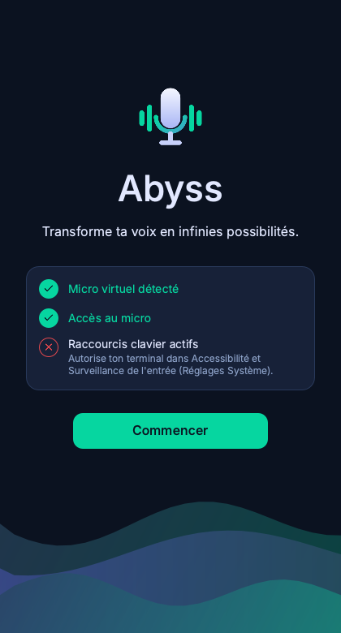
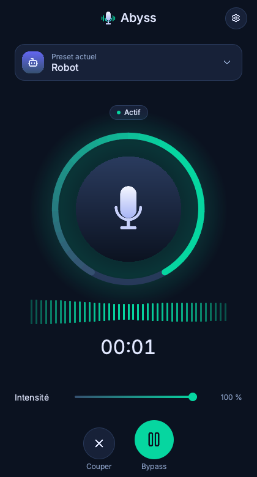
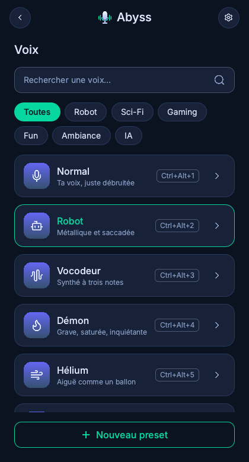
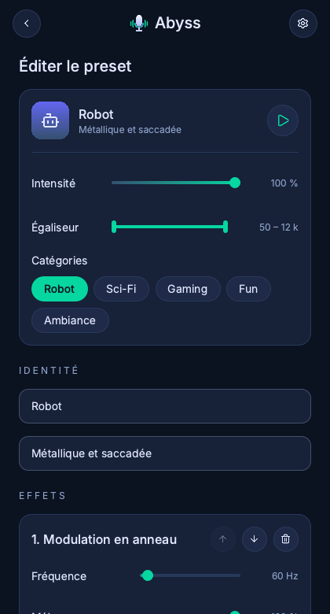
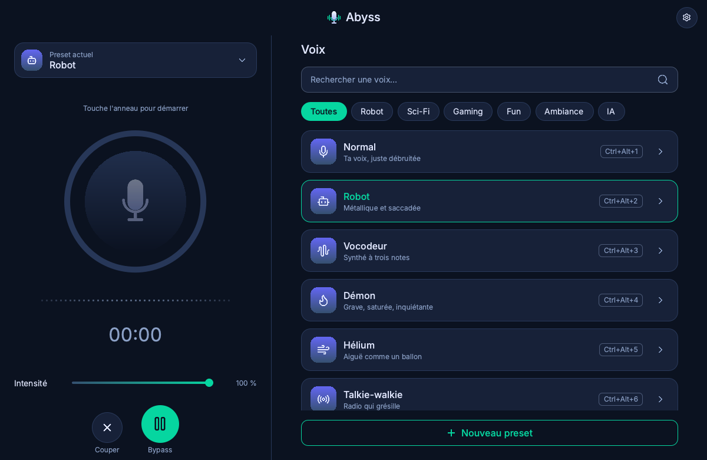

# Abyss : changeur de voix temps réel (macOS / Windows)

Micro réel → débruitage → effets → limiteur → **micro virtuel** (Discord, jeux) + retour casque optionnel.
100 % local. Effets DSP (robot, vocodeur, démon, hélium…), éditeur de presets, aperçu dans le casque.
Voix IA (RVC/ONNX) prévue en v2.

| Accueil | Direct | Voix | Éditeur |
|---|---|---|---|
|  |  |  |  |

Mode large (fenêtre > 760 px) :



## Installation

**macOS (Apple Silicon)**

```sh
brew install blackhole-2ch uv
# redémarre le Mac pour que BlackHole apparaisse
git clone https://github.com/simonssg1/abyss.git && cd abyss
uv sync
```

**Windows**

1. Installe [VB-CABLE](https://vb-audio.com/Cable/) (pilote du micro virtuel), puis redémarre.
2. Récupère le dépôt (`git clone https://github.com/simonssg1/abyss.git`, ou « Code → Download ZIP » sur GitHub).
3. Double-clique sur **`scripts\install_windows.cmd`**. Il installe uv via winget si besoin, prépare
   l'environnement (Python 3.11 compris), génère l'icône et crée le raccourci **« Abyss »** sur le Bureau
   et dans le menu Démarrer. Relançable sans risque.
4. Lance Abyss depuis le raccourci : aucune fenêtre de console, logs dans `%USERPROFILE%\.abyss\logs\abyss.log`.

Dans Abyss, choisis le micro, **CABLE Input** comme micro virtuel et ton casque. Dans Discord, l'entrée est
**CABLE Output**. Si le micro ne capte rien : Paramètres Windows → Confidentialité et sécurité → Microphone →
autoriser les applications de bureau. Pas d'autorisation à donner pour les raccourcis sur Windows.

## Lancer Abyss

**Depuis le Bureau (macOS)** : construis le lanceur une fois (outils en ligne de commande Xcode requis pour `swiftc`) :

```sh
./scripts/build_macos_launcher.sh
```

Il crée `~/Applications/Abyss.app` (icône Abyss) et un alias « Abyss » sur le Bureau. L'app exécute
toujours le code actuel du dépôt : inutile de la reconstruire après une mise à jour. Le script peut être
relancé sans risque (il remplace l'ancienne app). Logs : `~/.abyss/logs/launcher.log`.
Si Abyss tourne déjà, un nouveau double-clic ramène sa fenêtre au premier plan.

**En ligne de commande** :

```sh
uv run abyss                         # interface
uv run abyss --list-devices          # périphériques détectés
uv run abyss --headless --preset Robot          # sans interface (Ctrl+C pour quitter)
uv run abyss --render IN.wav --preset Démon --out OUT.wav
uv run abyss --render-all samples/synthetic_voice.wav   # un fichier par preset dans renders/
uv run abyss --gallery               # galerie des composants de l'interface
```

## Utilisation

- **Accueil** : la checklist vérifie le micro virtuel, l'accès au micro et les raccourcis. Désactivable dans Réglages.
- **Direct** : touche l'**anneau** pour démarrer ou arrêter le direct (rien n'est envoyé avant). « Preset actuel »
  ouvre la liste des voix. En bas : **couper la sortie** (✕) et **bypass** (voix sans effets). Le curseur
  **Intensité** dose l'effet du preset actif ; il est enregistré automatiquement.
- **Voix** : recherche et catégories. Un clic sur une ligne **utilise** la voix ; le chevron › ouvre l'**éditeur**.
- **Raccourcis globaux** : `Ctrl+Alt+1…8` = presets, `Ctrl+Alt+0` = bypass, `Ctrl+Alt+M` = retour casque
  (modifiables dans `~/.abyss/config.json`).

### Éditeur de presets

Intensité (dosage effet / voix d'origine), égaliseur coupe-bas / coupe-haut (50 Hz – 12 kHz), catégories,
nom, description, et la liste des effets : chaque effet a ses curseurs ; on peut en ajouter, retirer et
réordonner. Si le preset édité est actif, les changements s'entendent en direct ; quitter sans enregistrer
rétablit la version enregistrée. Actions : **Enregistrer**, **Dupliquer**, **Supprimer** (presets perso,
en deux clics), **Réinitialiser** (presets d'origine). Un preset créé porte le badge **Nouveau**.

Tes presets sont enregistrés dans `~/.abyss/presets.toml`, superposé aux presets d'origine du dépôt
(copie de sécurité `presets.toml.bak` à chaque écriture ; un preset invalide n'est jamais écrit).

### Aperçu ▶

Le bouton lecture d'un preset joue un extrait de 5 s **uniquement dans le casque** : il n'est jamais envoyé au
micro virtuel, tes amis ne l'entendent pas. La source est ta voix des 5 dernières secondes de direct
(gardée en mémoire, jamais écrite sur disque) ; sans direct, une voix de test synthétique. Il faut avoir
choisi un casque dans Réglages.

## Réglages Discord

- Périphérique d'entrée : **BlackHole 2ch** (macOS) ou **CABLE Output** (Windows).
- **Désactive** la suppression de bruit (Krisp), l'annulation d'écho et le contrôle automatique du gain :
  ils écrasent les effets.

## Autorisations macOS

Constaté avec le lanceur du Bureau (Réglages Système → Confidentialité et sécurité) :
- **Micro** : macOS demande l'accès au nom d'**« Abyss »** (« Abyss utilise ton micro pour transformer ta voix
  en temps réel. ») au premier démarrage du direct.
- **Raccourcis** : active **« Abyss.app »** dans **Surveillance de l'entrée** (l'Accessibilité n'est pas nécessaire).
- Lancé depuis le terminal (`uv run abyss`), ce sont les autorisations **du terminal** qui s'appliquent.
- Le lanceur est signé localement : si tu relances `build_macos_launcher.sh`, macOS peut redemander ces autorisations.

## Conseils

- **N'utilise pas le micro des AirPods** : il fait basculer le Bluetooth en qualité téléphone (24 kHz) et
  provoque des grésillements. Prends le micro du Mac ou un micro USB, et garde les AirPods pour le retour.
- Le retour casque est désactivé par défaut. Ne l'active pas sur des haut-parleurs (larsen).

## Ajouter un preset à la main

Dans `presets.toml` (presets d'origine) ou `~/.abyss/presets.toml` (perso) :

```toml
[[preset]]
name = "Géant"
hotkey_index = 9          # Ctrl+Alt+9
description = "Très grave"
icon = "flame"            # nom d'icône Lucide
categories = ["Gaming"]   # Robot, Sci-Fi, Gaming, Fun, Ambiance
intensity = 0.8           # 0–1
tone_low_hz = 80          # 50–12000
tone_high_hz = 9000
effects = [
  { type = "pitch_shift", semitones = -9 },
  { type = "reverb", room_size = 0.6, wet_level = 0.2 },
]
```

Types d'effets : `pitch_shift`, `ring_mod`, `vocoder`, `reverb`, `distortion`, `chorus`, `delay`, `bitcrush`,
`highpass`, `lowpass`, `compressor`, `noise_gate`, `gain` (paramètres : `src/abyss/processors/schema.py`).
Seuls `name` et `effects` sont obligatoires ; l'ancien format reste valide. `rvc` est réservé à la v2.

## Développement

```sh
uv run pytest                                               # tests (aucun warning QML toléré)
QT_QPA_PLATFORM=offscreen uv run python -m abyss.ui.capture --screens docs/screenshots   # captures
```

Voir `DECISIONS.md` pour les choix techniques, `docs/charte-abyss.png` pour la charte graphique.
